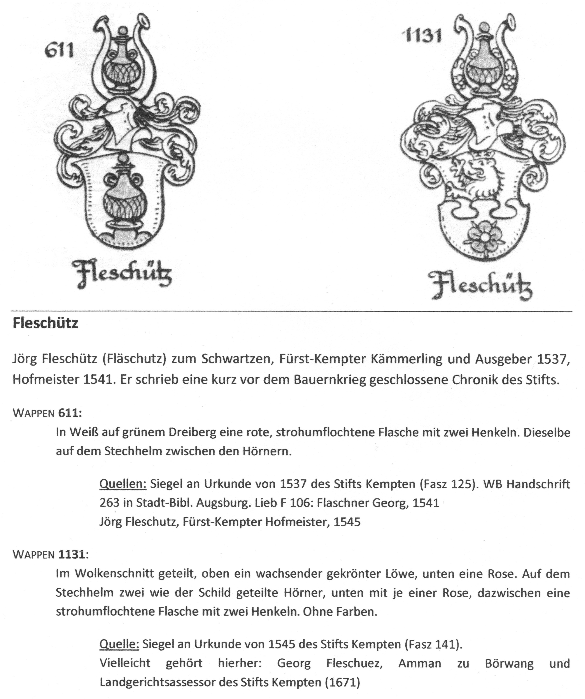
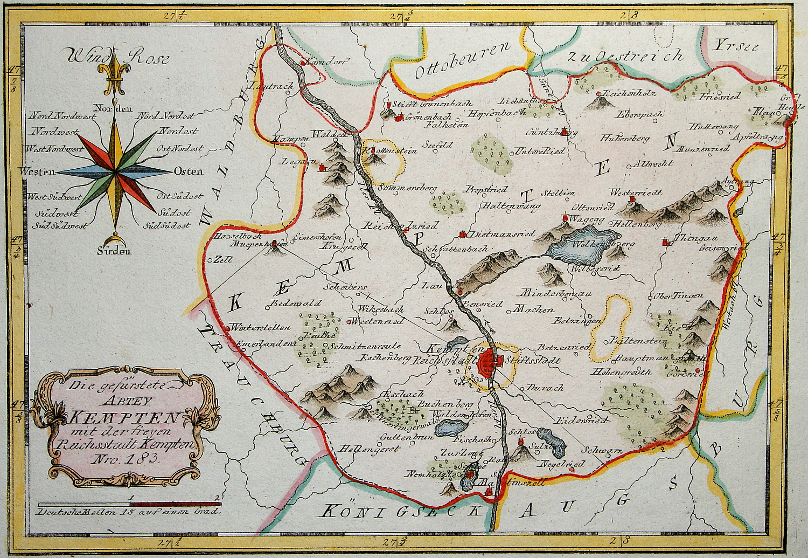

Chronik der Familie Fleschutz (1412-1942)
=========================================

**Legende:** * = Geburt, ⚭ = Hochzeit, † = Tod, 🛠 = Beruf, 💥 = Krieg, {} = Quelle (mehr Hinweise: siehe unten). 

| Jahr      | Ereignis                                                                                                                                                                                                                                                                                                                                                                                                                              |
| --------- | ------------------------------------------------------------------------------------------------------------------------------------------------------------------------------------------------------------------------------------------------------------------------------------------------------------------------------------------------------------------------------------------------------------------------------------- |
| 1412      | Utz Brästel genannt Fläschuz, kauft die Güter zu "Wyler" und "Mätzlins" (jetzt Fleschützen bei Börwang) vom Fürststift Kempten {[Brief & Urkunde 263](Quellen/Fuerststift_Kempten/Urkunde_263/)} (erste urkundliche Erwähnung)                                                                                                                                                                                                        |
| 1480      | Jörg Fleschütz, Haldenwanger Pfarr.                                                                                                                                                                                                                                                                                                                                                                                                   |
| 1505      | Vergleich zwischen Hans Johann Fleschutz und Hans Caspar Laubenberg {[Urkunde 1757](Quellen/Fuerststift_Kempten/Urkunde_1757/)}                                                                                                                                                                                                                                                                                                       |
| 1516      | Frevelgerichtsbarkeit zu Fleschützen {[Urkunde 2007](Quellen/Fuerststift_Kempten/Urkunde_2007/)}                                                                                                                                                                                                                                                                                                                                      |
| 1525      | 💥 Deutscher Bauernkrieg, 200 Allgäuer Höfe wurden in Brand gesteckt {[Wikipedia](Quellen/Wikipedia/Deutscher_Bauernkrieg.pdf)}                                                                                                                                                                                                                                                                                                       |
| 1530      | Georg Fleschutz (Hofmeister) kauft Wasserrecht zu Burkarts {[Urkunde 2546](Quellen/Fuerststift_Kempten/Urkunde_2546/)}, 1 Jahr später kauft er 2 Jauchert Acker {[Urkunde 2566](Quellen/Fuerststift_Kempten/Urkunde_2566/)}, 1540 kauft er ein Haus vom Konvent {[Urkunde 2915](Quellen/Fuerststift_Kempten/Urkunde_2915/)} und 1542 kauft er weitere 2 Häuser vom Konvent {[Urkunde 2984](Quellen/Fuerststift_Kempten/Urkunde_2984)} |
| 1537      |  {[Allgäuer Geschichtsfreund, Kempter Wappen und Zeichen](Quellen/Allgaeuer_Geschichtsfreund/Wappen.pdf)}                                                                                                                                                                                                                                                             |
| 1543      | Baltus Fleschutz, zum Weyler, genannt (bei den) Fleschutzen                                                                                                                                                                                                                                                                                                                                                                           |
| 1550      | Agatha Fleschutz verkauft ihr Gut zu Eschers (Untrasried) für 200 Gulden {[Urkunde 3316](Quellen/Fuerststift_Kempten/Urkunde_3316)}                                                                                                                                                                                                                                                                                                   |
| 1550-1743 | Güter und Untertanen zu Fleschützen {[Akte 1913](Quellen/Fuerststift_Kempten/Akte_1913)}                                                                                                                                                                                                                                                                                                                                              |
| 1554      | Georg Fleschutz (in Schwarzen) wegen verliehener Wirtschaftsgerechtsame {[Urkunde 3495](Quellen/Fuerststift_Kempten/Urkunde_3495/)} und {[Urkunde 3499](Quellen/Fuerststift_Kempten/Urkunde_3499)}                                                                                                                                                                                                                                    |
| 1564      | Baltasar Fleschutz (Scholare) will Priester werden                                                                                                                                                                                                                                                                                                                                                                                    |
| 1565      | Christoph Fleschutz kauft eine Gaststätte {[Urkunde 3800](Quellen/Fuerststift_Kempten/Urkunde_3800)}                                                                                                                                                                                                                                                                                                                                  |
| 1565      | Balthus Fleschutz zu Fleschützen bekommt Zinsbrief von Lukas Haini zu Bachtels {[Urkunde 3778](Quellen/Fuerststift_Kempten/Urkunde_3778)}                                                                                                                                                                                                                                                                                             |
| 1618-1648 | 💥 Dreißigjähriger Krieg, dadurch Hungersnöte und Seuchen. In Teilen Süddeutschlands überlebte nur ein Drittel der Bevölkerung {[Wikipedia](Quellen/Wikipedia/Dreissigjaehriger_Krieg.pdf)}                                                                                                                                                                                                                                           |
| 1658      | Hans Georg Fleschutz verkauft Baind zu Dickenbühl {[Urkunde 5642](Quellen/Fuerststift_Kempten/Urkunde_5642/)}                                                                                                                                                                                                                                                                                                                         |
| 1666      | Baltasar Fleschutz, Bauschreiber im Stift Kempten                                                                                                                                                                                                                                                                                                                                                                                     |
| 1686      | Georg Fleschutz zu Haubensteig kauft Weiderecht im Stadtallmey {[Akte 1127](Quellen/Fuerststift_Kempten/Akte_1127/)}                                                                                                                                                                                                                                                                                                                  |
| 1791      |  Karte des Territoriums der Fürstabtei Kempten von 1791 {[Wikipedia](Quellen/Wikipedia/Fuerststift_Kempten.pdf)}                                                                                                                                                                                                                                                                  |

| Vorname(n)            | Ereignis                                                                                                                                                                                                                                                                                                                                               |
| --------------------- | ------------------------------------------------------------------------------------------------------------------------------------------------------------------------------------------------------------------------------------------------------------------------------------------------------------------------------------------------------ |
| **Baltasar**          | †1646 ⚭Ursula Schneider {[Sterberegister](https://data.matricula-online.eu/de/deutschland/augsburg/haldenwang-bei-kempten/1-S/?pg=1)} (vermutlich verwandt)                                                                                                                                                                                            |
|                       |                                                                                                                                                                                                                                                                                                                                                        |
| **Georg**             | 🛠Hauptmann und Wirt ⚭1649 Sabina Brenberg(+1652) ⚭1654 Maria Heslin in Börwang {[Sterberegister Sabina](https://data.matricula-online.eu/de/deutschland/augsburg/haldenwang-bei-kempten/1-S/?pg=9)} {[Hochzeitsregister mit Maria](https://data.matricula-online.eu/de/deutschland/augsburg/haldenwang-bei-kempten/1-H/?pg=11)} (vermutlich verwandt) |
|                       |                                                                                                                                                                                                                                                                                                                                                        |
|                       | **Georg & Sabina & Maria's Kinder:** (in Börwang bei Haldenwang)                                                                                                                                                                                                                                                                                       |
| **Johann Georg**      | ⚭1663 Maria Briechler in B. {[Hochzeitsregister](https://data.matricula-online.eu/de/deutschland/augsburg/haldenwang-bei-kempten/1-H/?pg=19)}                                                                                                                                                                                                          |
| Maria                 | *1649 in B. {[Taufregister](https://data.matricula-online.eu/de/deutschland/augsburg/haldenwang-bei-kempten/1-T-1/?pg=10)} (vermutlich verwandt)                                                                                                                                                                                                       |
| Catharina             | *1651 in B. +1654 {[Taufregister](https://data.matricula-online.eu/de/deutschland/augsburg/haldenwang-bei-kempten/1-T-1/?pg=25)} (vermutlich verwandt)                                                                                                                                                                                                 |
| Ursula                | *1655 in B. {[Taufregister](https://data.matricula-online.eu/de/deutschland/augsburg/haldenwang-bei-kempten/1-T-1/?pg=41)}  (vermutlich verwandt)                                                                                                                                                                                                      |
| Elisabeth             | *1656 in B. {[Taufregister](https://data.matricula-online.eu/de/deutschland/augsburg/haldenwang-bei-kempten/1-T-1/?pg=45)} (vermutlich verwandt)                                                                                                                                                                                                       |
| Regina                | *1657 in B. {[Taufregister](https://data.matricula-online.eu/de/deutschland/augsburg/haldenwang-bei-kempten/1-T-1/?pg=51)} (vermutlich verwandt)                                                                                                                                                                                                       |
| Sabina                | *1659 in B. {[Taufregister](https://data.matricula-online.eu/de/deutschland/augsburg/haldenwang-bei-kempten/1-T-1/?pg=57)} (vermutlich verwandt)                                                                                                                                                                                                       |
|                       |                                                                                                                                                                                                                                                                                                                                                        |
|                       | **Johann Georg & Maria's Kinder:** (in Börwang bei Haldenwang)                                                                                                                                                                                                                                                                                         |
| Sabina                | *1664 in B. {[Taufregister](https://data.matricula-online.eu/de/deutschland/augsburg/haldenwang-bei-kempten/1-T-1/?pg=72)}                                                                                                                                                                                                                             |
| Roman                 | *1665 in B. {[Taufregister](https://data.matricula-online.eu/de/deutschland/augsburg/haldenwang-bei-kempten/1-T-1/?pg=75)}                                                                                                                                                                                                                             |
| Rosina                | *1666 in B. {[Taufregister](https://data.matricula-online.eu/de/deutschland/augsburg/haldenwang-bei-kempten/1-T-1/?pg=78)}                                                                                                                                                                                                                             |
| Ferdinand             | *1667 in B. {[Taufregister](https://data.matricula-online.eu/de/deutschland/augsburg/haldenwang-bei-kempten/1-T-1/?pg=80)}                                                                                                                                                                                                                             |
| Anna                  | *1669 in B. {[Taufregister](https://data.matricula-online.eu/de/deutschland/augsburg/haldenwang-bei-kempten/1-T-2/?pg=4)}                                                                                                                                                                                                                              |
| Barbara               | *1670 in B. {[Taufregister](https://data.matricula-online.eu/de/deutschland/augsburg/haldenwang-bei-kempten/1-T-2/?pg=7)}                                                                                                                                                                                                                              |
| Franz                 | *1671 in B. {[Taufregister](https://data.matricula-online.eu/de/deutschland/augsburg/haldenwang-bei-kempten/2-T/?pg=4)}                                                                                                                                                                                                                                |
| Maria                 | *1673 in B. {[Taufregister](https://data.matricula-online.eu/de/deutschland/augsburg/haldenwang-bei-kempten/2-T/?pg=7)}                                                                                                                                                                                                                                |
| Maria                 | *1675 in B. {[Taufregister](https://data.matricula-online.eu/de/deutschland/augsburg/haldenwang-bei-kempten/2-T/?pg=9)}                                                                                                                                                                                                                                |
| Franz                 | *1677 in B. {[Taufregister](https://data.matricula-online.eu/de/deutschland/augsburg/haldenwang-bei-kempten/2-T/?pg=12)}                                                                                                                                                                                                                               |
| Anna                  | *1679 in B. {[Taufregister](https://data.matricula-online.eu/de/deutschland/augsburg/haldenwang-bei-kempten/2-T/?pg=15)}                                                                                                                                                                                                                               |
| **Mang**              | *1680 in B., ⚭1717 Anna Maria Geiger in B. {[Hochzeitsregister](https://data.matricula-online.eu/de/deutschland/augsburg/haldenwang-bei-kempten/2-T/?pg=12)}                                                                                                                                                                                           |
| Josef                 | *1681 in B. {[Taufregister](https://data.matricula-online.eu/de/deutschland/augsburg/haldenwang-bei-kempten/2-T/?pg=19)}                                                                                                                                                                                                                               |
| Georg                 | *1683 in B. {[Taufregister](https://data.matricula-online.eu/de/deutschland/augsburg/haldenwang-bei-kempten/2-T/?pg=22)}                                                                                                                                                                                                                               |
|                       |                                                                                                                                                                                                                                                                                                                                                        |
|                       | **Mang & Anna Maria's Kinder:** (in Börwang bei Haldenwang)                                                                                                                                                                                                                                                                                            |
| Anna                  | *1718 in B. {[Taufregister](https://data.matricula-online.eu/de/deutschland/augsburg/haldenwang-bei-kempten/3-T/?pg=34)}                                                                                                                                                                                                                               |
| Anna Maria            | *1719 in B. {[Taufregister](https://data.matricula-online.eu/de/deutschland/augsburg/haldenwang-bei-kempten/3-T/?pg=36)}                                                                                                                                                                                                                               |
| Ferdinand             | *1721 in B. {[Taufregister](https://data.matricula-online.eu/de/deutschland/augsburg/haldenwang-bei-kempten/3-T/?pg=42)}                                                                                                                                                                                                                               |
| Johannes?             | *1723 in B. {[Taufregister](https://data.matricula-online.eu/de/deutschland/augsburg/haldenwang-bei-kempten/3-T/?pg=45)}                                                                                                                                                                                                                               |
| **Josef**             | *1725 in B. 🛠Bauer +06.04.1773 an böses Fieber in Waizenried bei Untrasried ⚭11.08.1757 Anastasia Trunzer in Untrasried {[Taufregister](https://data.matricula-online.eu/de/deutschland/augsburg/haldenwang-bei-kempten/3-T/?pg=50)}                                                                                                                  |
| Dominik               | *1726 in B. {[Taufregister](https://data.matricula-online.eu/de/deutschland/augsburg/haldenwang-bei-kempten/3-T/?pg=54)}                                                                                                                                                                                                                               |
|                       |                                                                                                                                                                                                                                                                                                                                                        |
|                       | **Josef & Anastasia's Kinder:** (auf Hof in Waizenried 79 bei Untrasried, jetzt Schindele-Hof) {[Familienbuch](https://data.matricula-online.eu/de/deutschland/augsburg/untrasried/16-FB/?pg=99)}                                                                                                                                                      |
| Anna Barbara          | *23.03.1758 in W. ⚭23.05.1793 mit Prack                                                                                                                                                                                                                                                                                                                |
| Jakob                 | *23.07.1760 in W., †01.08.1760 mit nur 9 Tagen                                                                                                                                                                                                                                                                                                         |
| **Leonhard**          | *04.11.1761 in W. 🛠Bauer †09.03.1814 ⚭11.7.1785 Maria Adelheid Waldmann                                                                                                                                                                                                                                                                               |
| Dominik               | *08.10.1762 in W. +1762                                                                                                                                                                                                                                                                                                                                |
| Maria Anna            | *18.07.1764 in W. ⚭04.02.1788 mit Stehele … nach Mittelberg                                                                                                                                                                                                                                                                                            |
| Sabina                | *26.10.1765 in W. †04.01.1766 mit nur 2 Monaten                                                                                                                                                                                                                                                                                                        |
| Jakob                 | *06.07.1768 in W.                                                                                                                                                                                                                                                                                                                                      |
| Afra                  | *06.08.1769 in W. †10.09.1769 mit nur 1 Monat                                                                                                                                                                                                                                                                                                          |
| Theodor               | *08.11.1770 in W.                                                                                                                                                                                                                                                                                                                                      |
| Anna Maria            | *31.12.1772 in W. †18.08.1773 mit nur 7 Monaten                                                                                                                                                                                                                                                                                                        |
| -                     | +23.10.1773 in W. (notgetauft)                                                                                                                                                                                                                                                                                                                         |
| Josef                 | *16.02.1775 in W. +09.03.1775 mit nur 21 Tagen                                                                                                                                                                                                                                                                                                         |
| Franz Josef           | *14.02.1776 in W.                                                                                                                                                                                                                                                                                                                                      |
|                       |                                                                                                                                                                                                                                                                                                                                                        |
|                       | **Leonhard & Maria Adelheid's Kinder:** (auf Hof in Waizenried 79 bei Untrasried, jetzt Schindele-Hof) {[Familienbuch](https://data.matricula-online.eu/de/deutschland/augsburg/untrasried/16-FB/?pg=99)}                                                                                                                                              |
| Johann Georg          | *07.07.1786 in W., †13.07.1786                                                                                                                                                                                                                                                                                                                         |
| Anna Maria            | *29.08.1787 in W. †04.09.1787 mit nur 6 Tagen                                                                                                                                                                                                                                                                                                          |
| -                     | +24.09.1788 in W. (notgetauft)                                                                                                                                                                                                                                                                                                                         |
| Genovefa              | *03.01.1790 in W. †09.01.1790 mit nur 6 Tagen                                                                                                                                                                                                                                                                                                          |
| **Johann Georg**      | *20.04.1791 in W. 🛠Bauer †06.06.1865 ⚭ Maurus ... ⚭ Kreszentia Reichart                                                                                                                                                                                                                                                                               |
| M. Afra               | *05.08.1794 in W.                                                                                                                                                                                                                                                                                                                                      |
| Ulrich                | *04.07.1796 in W. †17.09.1861 in Burg ⚭Creszentia Hartmann, *25.12.1791                                                                                                                                                                                                                                                                                |
| Franziska             | *03.10.1797 in W.                                                                                                                                                                                                                                                                                                                                      |
| Johann Baptist        | *23.06.1799 in W. †13.02.1875 in Engetried ⚭ Maria Kreszenz Epp (*10.09.1798 †06.12.1862)                                                                                                                                                                                                                                                              |
| Maria Anna            | *16.07.1805 in W. †1.7.1810 mit nur 5 Jahren                                                                                                                                                                                                                                                                                                           |
|                       |                                                                                                                                                                                                                                                                                                                                                        |
|                       | **Johann Georg & Maurus & Kreszentia's Kinder:** (auf Hof in Waizenried 79 bei Untrasried, jetzt Schindele-Hof) {[Familienbuch](https://data.matricula-online.eu/de/deutschland/augsburg/untrasried/16-FB/?pg=99)}                                                                                                                                     |
| Franz Xaver           | *03.02.1818 in W. †06.02.1818 mit nur 3 Tagen                                                                                                                                                                                                                                                                                                          |
| Maria Anna            | *12.10.1819 in W. †14.07.1867 in Kraftisried?                                                                                                                                                                                                                                                                                                          |
| Karolina              | *16.03.1821 in W.                                                                                                                                                                                                                                                                                                                                      |
| Franz Xaver           | *13.05.1822 in W. †19.05.1822 mit nur 6 Tagen                                                                                                                                                                                                                                                                                                          |
| Johann Georg          | *14.08.1823 in W. †24.04.1830                                                                                                                                                                                                                                                                                                                          |
| Johann ?              | *02.08.1824 in W. †28.08.1824 mit nur 1 Monat                                                                                                                                                                                                                                                                                                          |
| Ignaz                 | *31.07.1825 in W. †17.09.1825 mit nur 46 Tagen                                                                                                                                                                                                                                                                                                         |
| M. Josefa             | *31.10.1826 in W.                                                                                                                                                                                                                                                                                                                                      |
| Johannes Chrysostomus | *09.02.1828 in W. †1907 in Obg. ⚭24.11.1862 Maria Antonia Schindele (zog als Privatier nach Obg.)                                                                                                                                                                                                                                                      |
| Johann L.             | *24.06.1829 in W. †02.03.1830                                                                                                                                                                                                                                                                                                                          |
| **Theresia**          | *01.06.1831 in W. 🛠Privatiere †25.11.1901 in Ostenried 71 bei Untrasried {[Sterbebild](Quellen/Sterbebilder/1831_Theresia.jpg)}                                                                                                                                                                                                                       |
| Theodor               | *20.10.1832 in W. †1915 in Albrechts                                                                                                                                                                                                                                                                                                                   |
| Alois                 | *24.03.1834 in W.                                                                                                                                                                                                                                                                                                                                      |
| Johann Georg          | *19.11.1835 in W. †03.04.1880 in Ostenried 71                                                                                                                                                                                                                                                                                                          |
| Johann Heinrich       | *27.04.1837 in W. ⚭21.2.1881 in Altdorf mit Maria Anna T. (2 Monate Hof, Trübsinn)                                                                                                                                                                                                                                                                     |
|                       |                                                                                                                                                                                                                                                                                                                                                        |
|                       | **Theresia & Xaver Prinz's Kind**: {[Familienbuch](https://data.matricula-online.eu/de/deutschland/augsburg/untrasried/16-FB/?pg=99)}                                                                                                                                                                                                                  |
| **Johann Georg**      | *09.05.1868 in Ostenried 71 bei Untrasried 🔨Bauer †05.01.1933 {[Sterbebild](Quellen/Sterbebilder/1868_Georg.jpg)} ⚭ Apollonia Mayr (*09.02.1870 +08.12.1957 {[Sterbebild](Quellen/Sterbebilder/1870_Apollonia.jpg)})                                                                                                                                  |
|                       |                                                                                                                                                                                                                                                                                                                                                        |
|                       | **Johann Georg & Apollonia's Kinder:** (zuerst in Ostenried 71 bei Untrasried, dann in Albrechts 12 bei Günzach)                                                                                                                                                                                                                                       |
| **Johann**            | *30.12.1895 in O. 🛠Bauer †29.05.1955 in A. {[Sterbebild](Quellen/Sterbebilder/1895_Johann)} ⚭ Sophie Hartmann (*23.03.1904 in Untereiberg †30.09.1977 in A. {[Sterbebild](Quellen/Sterbebilder/1904_Sophie.jpg)})                                                                                                                                     |
| Maria                 | *25.01.1897 in O. †05.01.1990                                                                                                                                                                                                                                                                                                                          |
| Theresia              | *27.04.1902 in O. †25.06.1987 ⚭Johann Kustermann                                                                                                                                                                                                                                                                                                       |
| Georg                 | *19.04.1903 in O. †19.04.1903 mit nur 1 Tag                                                                                                                                                                                                                                                                                                            |
| Johann Georg          | *13.08.1906 in A. †09.05.1935                                                                                                                                                                                                                                                                                                                          |
| Theodor               | *10.12.1907 in A. 🛠Soldat †28.09.1942 bei Leningrad, Russland {[Sterbebild](Quellen/Sterbebilder/1907_Theodor.jpg)}                                                                                                                                                                                                                                   |
|                       |                                                                                                                                                                                                                                                                                                                                                        |
|                       | 1914-1918 💥 1. Weltkrieg mit ca. 17 Millionen Toten {[Wikipedia](Quellen/Wikipedia/Erster_Weltkrieg.pdf)}                                                                                                                                                                                                                                             |
|                       | 1939-1945 💥 2. Weltkrieg mit ca. 60-80 Millionen Toten {[Wikipedia](Quellen/Wikipedia/Zweiter_Weltkrieg.pdf)}                                                                                                                                                                                                                                         |
|                       |                                                                                                                                                                                                                                                                                                                                                        |
|                       | **Johann & Sophie's Kinder:** (auf Hof in Albrechts 12 bei Günzach)                                                                                                                                                                                                                                                                                    |
| Georg                 | *21.01.1935 in A., †19.03.1935 mit nur 2 Monaten                                                                                                                                                                                                                                                                                                       |
| Amalie Maria Anna     | *20.02.1936 in A. 🛠Bäuerin                                                                                                                                                                                                                                                                                                |
| Apollonia Theresia    | *29.05.1937 in A.                                                                                                                                                                                                                                                                                                                                      |
| Johann 'Hans'         | *05.12.1938 in A. †13.05.2025 in A. 🛠Bauer ⚭ Rosmarie Höbel *18.12.1947 {[Todesanzeige](Quellen/Todesanzeigen/2025_Johann.jpg)}                                                                                                                                                                                                                       |
| Theodor Konrad        | *12.11.1942 in A. 🛠Molkerei-Meister ⚭ Sigrun Friede (*01.04.1949 in Radolfzell)                                                                                                                                                                                                                                                                       |

💡 Hinweise
-----------

* Zur Namensentstehung von Fleschutz: der Brief von 1412 beginnt mit "Ich Utz Brästel den man nennt fläsch ützen...". Mit Leerzeichen, wahrscheinlich Kurzform von: Flaschner Utz (siehe auch Wappen mit Flasche). Grund dafür waren wohl mehrere Utz Brästel im selben Ort (Vater/Großvater/Onkel/Cousin?). In der darauffolgenden (Kauf-)Urkunde wird daraus: "fläschüzen" (ohne Leerzeichen, ohne T).
* *"Flaschner"* bedeutete früher: Blechschmied, *"Haus mit Taferngerechtigkeit"* = Gaststätte, *"Federspiel"* = Falkenjagd, *"in den Hölzern"* = im (Forst-)Wald, *"Frevel"* = leichteres Vergehen, *"Privatiere"* = wohlhabende Frau ohne Erwerbstätigkeit.
* Die Kirchenbücher in Haldenwang beginnen ab dem Jahr 1639. Anfangs in Latein, später in Deutsch. Als Handschrift wurden früher [Deutsche Kurrentschrift](Quellen/Wikipedia/Deutsche_Kurrentschrift.pdf) oder [Sütterlinschrift (ab 1911)](Quellen/Wikipedia/Suetterlinschrift.pdf) verwendet.
* Stand der Chronik ist 16. Mai 2025. Sie ist auch verfügbar in den Formaten: [.DOCX](Export/Chronik.docx), [.EPUB (für E-Books)](Export/Chronik.epub), [.HTML](Export/Chronik.html), [.ODT](Export/Chronik.odt), [.OPML](Export/Chronik.opml), [.PDF](Export/Chronik.pdf), [.RST](Export/Chronik.rst), [.RTF](Export/Chronik.rtf), [.TEX](Export/Chronik.tex), [.TEXTILE](Export/Chronik.textile), [.WIKI](Export/Chronik.wiki).

👏 Danksagung
--------------

Herzlichen Dank an alle die bei dieser Chronik mitgeholfen haben:

* An Karl Fleschutz und seinen Großvater für ihre Ahnenforschung und ihre Chronik der Familie Fleschutz in Burg.
* An [Matricula Online](https://data.matricula-online.eu/de/) für das Einscannen der vielen Kirchenbücher in Europa.
* Ans [Staatsarchiv Augsburg](https://www.gda.bayern.de/augsburg) für die Einsichtnahme in die Urkunden und Akten.
* An [Transkribus](https://www.transkribus.org/de/kurrentschrift-uebersetzen) für die maschinelle Schriftübersetzung.
* An Bernhard für die Sterbebilder und an Jörg für den Hinweis zu Matricula Online.
* An Andrea für das schwierige Entziffern der Handschriften.
* Und natürlich an Manuel, der für ein Schulprojekt den (Chronik-)Stein ins Rollen brachte 😊
